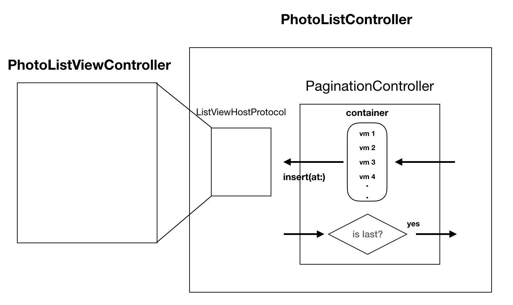

# SightSurfing - Find interesting spots without a hassle

This is a demo app, showcasing how to use protocol techniques to reduce the replication of code and inverse the dependency of a type.  

Detailed article is under construction, here's the spoiler of the system design: 

